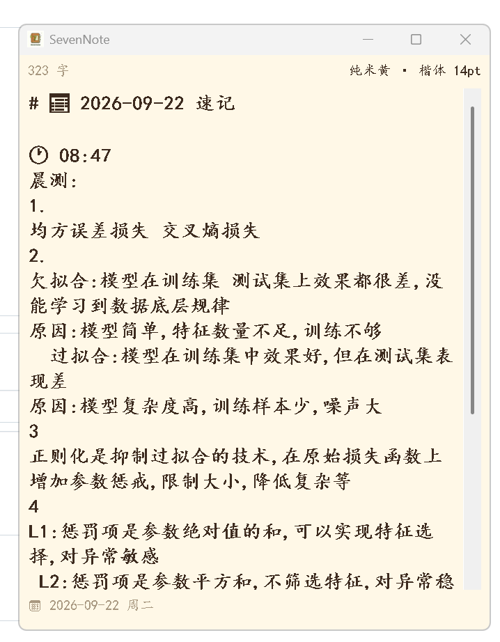
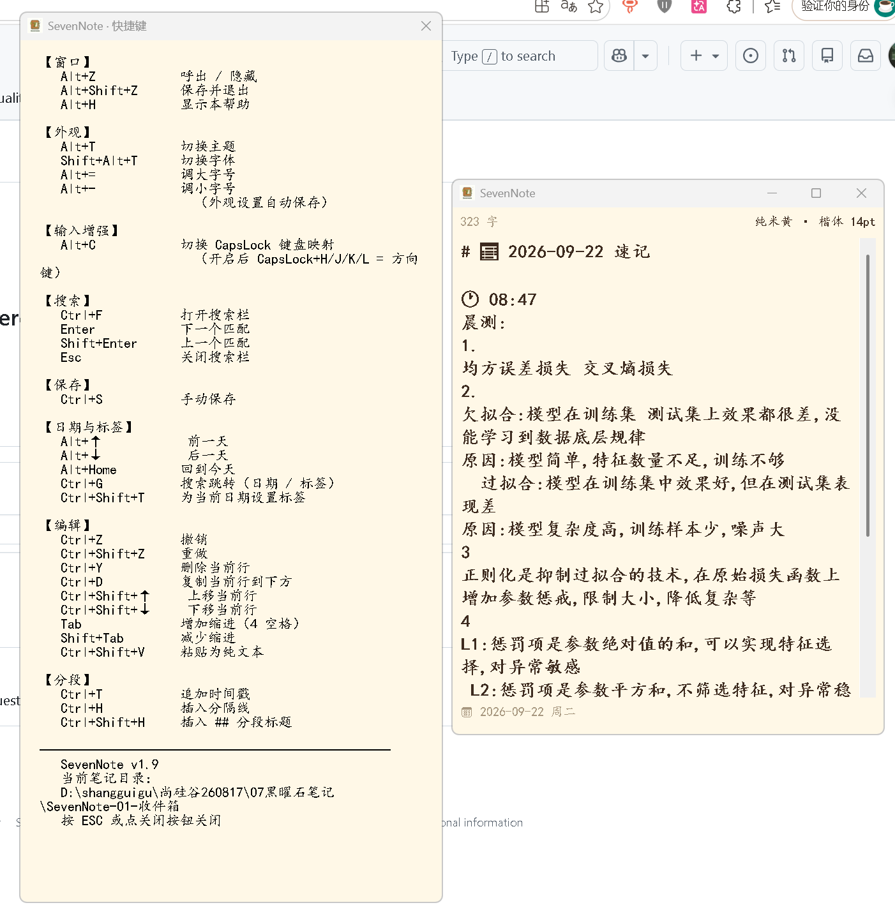
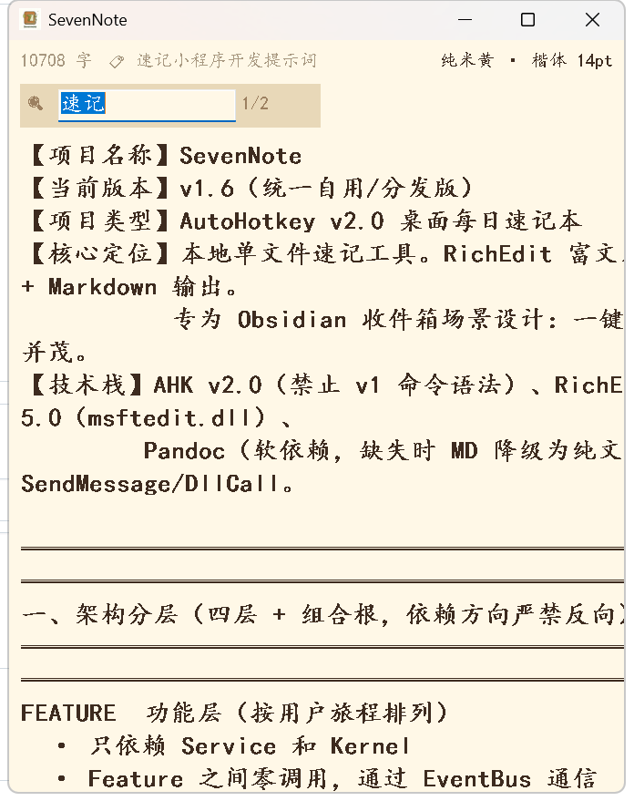
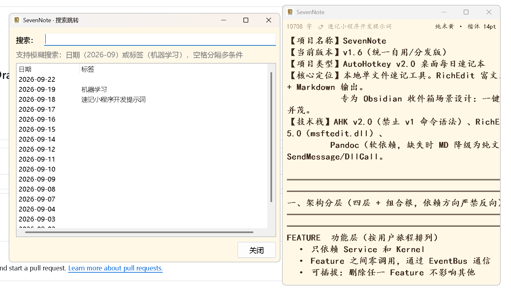
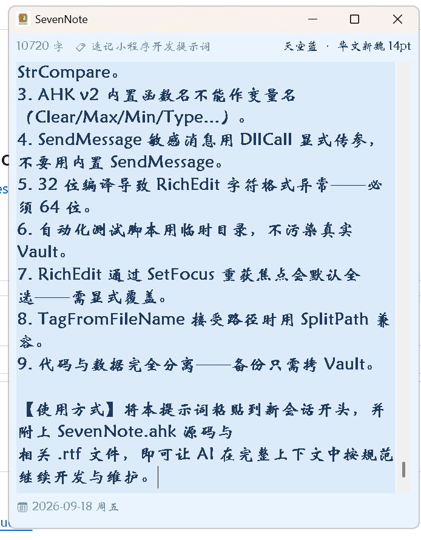
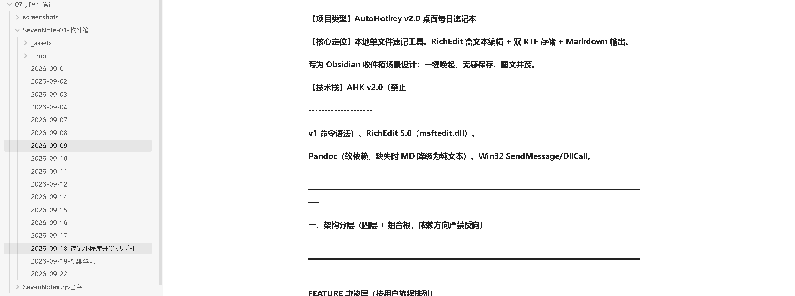

# SevenNote-AutoHotKey
Lightweight daily scratchpad for Windows (AHK v2): RichEdit editing, dual RTF storage, Pandoc → Markdown, Obsidian inbox. One hotkey, auto-save, image support, date tags.
# SevenNote

> 一键唤起的 Windows 本地速记工具 —— 富文本编辑 + 双 RTF 存储 + Markdown 输出
> 为 Obsidian 收件箱场景设计，走到哪记到哪，图文并茂、无感保存、标签管理


## 界面预览

### 主界面


### 帮助页面


### 检索页面


### 日期跳转


### 主题字体切换


### 在 Obsidian 中回顾


---

## ✨ 为什么用 SevenNote

### 痛点

你是否有过这些体验：

- 想记点什么，**打开笔记软件要 3~5 秒**，灵感已经跑了
- 记录时想**加粗重点、插张图、标个颜色**，结果只有纯文本
- 记完的笔记**散落在时间线里**，一个月后完全想不起哪天记过什么
- 已有的笔记软件要么**太重**（100MB 内存起步），要么**太轻**（不支持富文本）
- 同步到 Obsidian 时**图片链接全丢**，格式乱成一团

### SevenNote 的答案

| 你的需求 | SevenNote 的做法 |
| --- | --- |
| **秒级唤起** | 全局热键 `Alt+Z`，100ms 内呼出/隐藏，不打断工作流 |
| **富文本编辑** | 基于 RichEdit：加粗、颜色、字体、内嵌图片，一个不少 |
| **图片随手粘** | `Ctrl+V` 直接粘图，自动存 PNG，自动生成 Markdown 链接 |
| **能一眼找到** | 每天一个标签，写在文件名里：`2026-09-20-机器学习.md` |
| **和 Obsidian 无缝** | 自动生成 `.md` + `_assets/日期/` 图片目录，Obsidian 直接读 |
| **不丢数据** | 定时 / 隐藏 / 切日期 / 粘贴 自动保存，空笔记不落盘 |
| **轻量不打扰** | 单 EXE ~250MB（含 Pandoc），运行内存 ~10MB，纯 Windows 原生 |

---

## 🎯 核心特性

### 🪶 极致轻量

- **启动 < 100ms**：双击即用，不拖累系统
- **内存 ~10MB**：常驻后台无感
- **单文件分发**：`SevenNote.exe` 一个文件，无需安装
- **零依赖运行**：EXE 版内置 Pandoc，用户无需装任何东西

### 📝 富文本编辑

- 加粗、斜体、颜色、字体大小，随时切换
- **`Ctrl+V` 直接粘图**，自动存到 `_assets/日期/`
- **`Ctrl+Shift+V` 粘贴纯文本**，剥离外部格式
- **Tab 缩进不丢字符格式**（很多编辑器做不到这点）

### 💾 双格式归档

保存时同时输出两种格式，各取所需：

```
936 RTF（GBK）   → WPS / Word / 写字板 打开都正常
65001 RTF（UTF-8） → 给 Pandoc 转 Markdown
最终产物：
  .rtf  富文本母版（保真）
  .md   Markdown 译本（便携）
  _assets/日期/  图片附件
```

### 🏷️ 标签系统

**标签写在文件名里**，黑曜石里见名知意：

```
无标签：  2026-09-20.md
有标签：  2026-09-20-机器学习.md
```

- `Ctrl+Shift+T` 一键设标签
- 顶部状态栏常驻显示：`🏷 机器学习`
- `Ctrl+G` 统一搜索日期 / 标签，双击跳转

### 🗓️ 日期管理

- `Alt+↑ / Alt+↓` 前后一天
- `Alt+Home` 一键回今天
- **状态栏显示星期**：`📅 2026-09-20 周日`
- **切日期自动定位到开头**（不是末尾）
- **空笔记不落盘**：Vault 永远干净

### 🎨 6 套主题 + 7 种字体

- **主题**：纯米黄 / 护眼绿 / 天空蓝 / 薄荷绿 / 高雅灰 / 纸白
- **字体**：楷体 / 华文行楷 / 华文新魏 / 方正舒体 / 仿宋 / 微软雅黑 / 黑体
- **字号**：12 / 14 / 16 / 18 / 20 pt
- **`Alt+T` 切主题，`Alt+Shift+T` 切字体，`Alt+=/-` 调字号**
- 全部自动记忆，重启保留

### ⌨️ 输入增强

- `CapsLock+H/J/K/L` = 方向键（`Alt+C` 开关）
- 写长文时手不离主键区
- 可选，不影响正常 CapsLock 使用

---

## 🚀 快速开始

### 方式 A：使用 EXE（推荐普通用户）

1. 从 [Releases](../../releases) 下载 `SevenNote.exe`（约 250MB，内含 Pandoc）
2. 放到任意非系统盘目录（如 `D:\tools\`）
3. **关闭杀毒软件**（AHK 编译的 EXE 常被误报）
4. 双击运行
5. 首次弹框 → **选择笔记存储目录**（如 `D:\我的笔记\SevenNote`）
6. 按 `Alt+Z` 呼出 → 开始使用

### 方式 B：使用源码（推荐开发者）

1. 安装 [AutoHotkey v2](https://www.autohotkey.com/)
2. 安装 [Pandoc](https://mirrors.lzu.edu.cn/)（国内镜像，选 `x86_64` 版）
3. 把 `SevenNote.ahk` 放任意位置，双击运行
4. 首次运行会弹框让你选笔记目录

---

## ⌨️ 快捷键一览

### 全局热键（任何程序中都生效）

| 热键 | 功能 |
| --- | --- |
| `Alt+Z` | 呼出 / 隐藏 |
| `Alt+Shift+Z` | 保存并退出 |
| `Alt+H` | 显示快捷键帮助 |
| `Alt+↑ / Alt+↓` | 前一天 / 后一天 |
| `Alt+Home` | 回到今天 |
| `Alt+T` | 切换主题 |
| `Shift+Alt+T` | 切换字体 |
| `Alt+= / Alt+-` | 调大 / 调小字号 |
| `Alt+C` | 切换 CapsLock 键盘映射 |

### 编辑器内热键（窗口激活时）

| 热键 | 功能 |
| --- | --- |
| `Ctrl+S` | 手动保存 |
| `Ctrl+Z / Ctrl+Shift+Z` | 撤销 / 重做 |
| `Ctrl+Y` | 删除当前行 |
| `Ctrl+D` | 复制当前行到下方 |
| `Ctrl+Shift+↑ / ↓` | 上移 / 下移当前行 |
| `Tab / Shift+Tab` | 增加 / 减少缩进（不丢格式） |
| `Ctrl+Shift+V` | 粘贴为纯文本 |
| `Ctrl+T` | 追加时间戳 |
| `Ctrl+H` | 插入分隔线 |
| `Ctrl+Shift+H` | 插入 `## 分段` 标题 |
| `Ctrl+F` | 打开搜索栏 |
| `Ctrl+G` | 搜索跳转（日期 / 标签） |
| `Ctrl+Shift+T` | 为当前日期设置标签 |

### 搜索栏内

| 热键 | 功能 |
| --- | --- |
| `Enter / Shift+Enter` | 下一个 / 上一个匹配 |
| `Esc` | 关闭搜索栏 |

---

## 📁 文件结构

### Vault 目录（你的笔记）

```
你的Vault/
├── 2026-09-20.rtf                富文本母版
├── 2026-09-20.md                 Markdown 译本
├── 2026-09-20-机器学习.rtf        带标签的富文本
├── 2026-09-20-机器学习.md         带标签的 Markdown
├── _assets/                      ★ 图片统一收纳
│   ├── 2026-09-20/
│   │   └── image1.png
│   └── 2026-09-19/
│       └── image2.png
└── _tmp/                         pandoc 临时目录（自动清理）
```

### 配置目录（AppData）

```
C:\Users\<用户名>\AppData\Roaming\SevenNote\
├── _config.ini                   配置（几百字节）
└── pandoc.exe                    内嵌的 Pandoc（仅 EXE 版）
```

### 笔记内容示例

```markdown
# 📅 2026-09-20 速记

🕐 09:15
今天开会讨论了三件事：
- 项目进度
- 人员安排
- 下周计划


🕐 14:30
下午想到一个点子……
```

---

## 🔧 技术特色

### 架构：四层 + 组合根

```
┌─────────────────────────────────────────────────────┐
│ FEATURE  功能层（18 项，按用户旅程排列）             │
│  · Feature 之间零调用，通过 EventBus 通信            │
│  · 可插拔：删除任一 Feature 不影响其他               │
├─────────────────────────────────────────────────────┤
│ SERVICE  服务层（6 项，纯能力）                     │
│  · 无业务、无时间、无理由                            │
│  · 被多个 Feature 共用                              │
├─────────────────────────────────────────────────────┤
│ KERNEL   骨架层（4 项）                             │
│  · 生命周期 / 状态 / 事件 / 配置                     │
│  · 冻结，只加不改                                    │
├─────────────────────────────────────────────────────┤
│ 表示层：StatusBar  ·  组合根：装配 + 启动            │
└─────────────────────────────────────────────────────┘

依赖方向：Feature → Service → Kernel → OS（严禁反向）
```

### 三个核心设计决策

**1. 用 `EM_STREAMOUT/EM_STREAMIN` 直读直写 RTF**

不碰剪贴板（剪贴板是程序间共享资源，用它做进程内私有通道会引发并发竞争）。所有保存/加载都走 Win32 消息，稳定、无副作用。

**2. 用 Pandoc 转换 RTF → Markdown**

不自研解析器（原版 150 行自研解析器脆弱，依赖隐式约定）。Pandoc 成熟稳定，图片位置按 RTF 结构精确提取。

**3. 双 RTF 输出（936 + 65001）**

RichEdit 只输出非标编码，Pandoc/Word 认的标准不同——**三方各有死结**。只能每次保存输出两份 RTF，各给一方。

### 代码与数据分离

| 类别 | 位置 | 备份 |
| --- | --- | --- |
| **代码** | `SevenNote.exe`（放哪都行） | ❌ 不需 |
| **笔记数据** | Vault 目录（用户选的） | ✅ **只需备份这个** |
| **程序配置** | `%AppData%\SevenNote\_config.ini` | ⚠️ 可选 |
| **内嵌 Pandoc** | `%AppData%\SevenNote\pandoc.exe` | ❌ 自动释放 |

**备份策略**：只拷 Vault 目录，其他丢了都能重建。

---

## ❓ 常见问题

### Q1：双击 `.ahk` 报"此应用无法在你的电脑上运行"

装的是 **AutoHotkey v1**（不是 v2），或装了 **ARM64 版**。

**修复**：
1. 卸载现有 AutoHotkey
2. 下载 x64 版：`https://www.autohotkey.com/download/ahk-v2.exe`
3. 安装后重试

**验证**：托盘图标右键 → About → 版本必须是 v2.0.x

### Q2：保存时报"此应用无法在你的电脑上运行"

`%AppData%\SevenNote\pandoc.exe` 是**坏文件**（0KB / ARM64 / 损坏）。

**修复**：
1. Win+R → `%AppData%\SevenNote` → 回车
2. **删除** `pandoc.exe`
3. 下载 x86_64 版 pandoc，放到该目录
4. 重启 SevenNote

**临时方案**：删掉 `pandoc.exe` 不装 → 保存降级为纯文本 `.md`，笔记不丢。

### Q3：粘贴图片后 `.md` 里没有图片

Pandoc 不可用，走了降级路径。

**排查**：cmd 运行 `"%AppData%\SevenNote\pandoc.exe" --version`：
- 显示版本号 → pandoc OK，可能是图片是 OLE 对象（从 Word 复制的）→ 改用 `Win+Shift+S` 截图后粘贴
- 报错 / 找不到 → 装 x64 版 pandoc

### Q4：`.rtf` 文件全篇带下划线

**32 位编译**导致的（加载了 32 位 `msftedit.dll`）。

**修复**：用 **64 位 Unicode** 重新编译。

### Q5：找不到 Vault 路径

- `Alt+H` → 帮助窗口底部显示"当前笔记目录"
- 或看 `%AppData%\SevenNote\_config.ini` 里的 `Vault=`

**换 Vault**：编辑 `_config.ini` 改 `Vault=`，或删这行重启让程序弹框重选。

### Q6：改了主题/字体，重启后没保存

`%AppData%\SevenNote\_config.ini` 没有写权限或被占用。

**修复**：
1. 关闭 SevenNote
2. 删除 `_config.ini`
3. 重开 → 重新设置

### Q7：如何备份

**只备份 Vault 目录**（如 `D:\我的笔记\SevenNote\`）——包含所有 `.rtf` / `.md` / `_assets`。

配置和内嵌 pandoc 丢了都能重建，不重要。

---

## 🛠️ 开发指南

### 添加新功能

**核心原则**：不动 Kernel / Service，只加 Feature。

**步骤**：
1. 在 FEATURE 层加一个类
2. 组合根注册热键
3. 通过 `EventBus.Emit` 通知结果

**示例**：加"导出 HTML"

```ahk
class ExportFeature {
    static ExportHtml() {
        hwnd := State.GetEd()
        rtfPath := NoteStoreService.RtfPath(State.GetDate())
        htmlPath := NoteStoreService.TempDir() . "\export.html"
        cmd := '"' . Config.PandocPath . '" "' . rtfPath . '" -o "' . htmlPath . '"'
        RunWait(A_ComSpec . ' /c "' . cmd . '"', , "Hide")
        Run(htmlPath)
    }
}
```

组合根加一行：

```ahk
!e::ExportFeature.ExportHtml()
```

**完成**，不需要改任何其他 Feature。

### 添加新主题

`ThemeService.Themes` 数组加一行：

```ahk
{name: "暗夜黑", win: "1E1E1E", edBg: "252526", text: "D4D4D4", dim: "808080"},
```

加完 `Alt+T` 自动循环到新主题。

### 关键坑点（踩过的坑）

| 坑 | 说明 |
| --- | --- |
| `Clear` / `log` / `min` / `max` 不能做变量名 | AHK v2 内置函数名 |
| AHK v2 的 `<` `>` 是数值比较 | 字符串比较用 `StrCompare` |
| `EM_SETSEL` / `EM_GETSEL` 用 DllCall | 内置 SendMessage 对 INT 参数有歧义 |
| `FINDTEXTEXW` 读偏移 16/20 | 误读 0/4 会导致搜索只找到 1 个 |
| 32 位编译导致 RichEdit 下划线 | **必须 64 位编译** |
| `FileInstall` 必须一行 | 折行会导致打包 0KB 空文件 |
| `FileExist` 返回 `"A"` 不是 `true` | 断言需 `!!` |

---

## 📦 分发给他人

### 打包步骤

1. **准备 pandoc**：下载 `pandoc-x.x.x-windows-x86_64.zip`，解压得到 `pandoc.exe`（约 223MB）
2. **改源码**：`FileInstall` 那行的源路径改成本机 pandoc 实际路径（**必须一行**）
3. **编译**：
   - 右键 `SevenNote.ahk` → Compile Script
   - **Base File 必须选 `Unicode 64-bit`**（不要选 32 位 / ARM64）
   - 编译时**看输出有没有 `Embedding: ...pandoc.exe`**
4. **验证**：编译后的 EXE 应该 **250MB 左右**；右键属性 → 详细信息 → 体系结构 = **x64**
5. **自己先测**：删 `%AppData%\SevenNote\pandoc.exe` → 双击新 EXE → 看释放出的是 223MB → 保存图片进 `_assets/`
6. **压缩成 ZIP 分发**：用**网盘**传输，**别用微信/QQ 直发 exe**（会重编码损坏）

### 对方使用

1. 解压 ZIP 到任意目录
2. **关闭杀毒软件**（临时）
3. 双击 `SevenNote.exe`
4. 首次运行弹框 → 选笔记目录
5. `Alt+Z` 开始使用

### 注意事项

| 事项 | 说明 |
| --- | --- |
| 不要放 `C:\Program Files\` | 需要管理员权限 |
| 传输方式 | 网盘 / ZIP，不要微信直发 |
| 杀毒软件 | 需临时关闭或加白名单 |
| 首次运行慢 | 释放 pandoc，第二次起正常 |

---

## 📋 版本历史

| 版本 | 日期 | 变化 |
| --- | --- | --- |
| **v1.9** | 2026-09-20 | 修复 pandoc 打包 0KB 问题；`PandocService` 加文件有效性校验（>1MB） |
| v1.8 | 2026-09-20 | 状态栏日期后显示星期（`📅 2026-09-20 周日`） |
| v1.7 | 2026-09-19 | assets 统一收纳到 `_assets/日期/`；切日期光标到开头 |
| v1.6 | 2026-09-19 | 路径分离（统一自用/分发）；首次运行引导；Pandoc 双路径；代码数据分离 |
| v1.5 | 2026-09-19 | 修复启动/切日期时标签不显示；搜索框加宽；标签字号固定 |
| v1.4 | 2026-09-19 | 标签顶部持久显示；窗口最小尺寸限制 |
| v1.3 | 2026-09-19 | 修复搜索计数；修复搜索栏关闭后编辑区全选 |
| v1.2 | 2026-09-19 | 标签系统（文件名带标签）；统一搜索跳转（Ctrl+G）；返回当天（Alt+Home） |
| v1.1 | 2026-09-19 | 空笔记不落盘；先查后存；Tab 缩进不丢格式 |
| v1.0 | 2026-09-18 | 首次发布：30 项热键 / 6 套主题 / 7 种字体 |

---

## ⚠️ 已知限制

| 限制 | 说明 |
| --- | --- |
| 仅 Windows | AHK v2 只支持 Windows |
| Pandoc 软依赖 | 未装则 MD 无格式、无图片链接（笔记不丢） |
| 不支持跨日期全文搜索 | 搜索只在当前笔记内 |
| 无云同步 | 用 OneDrive / 坚果云替代 |
| 标签单字段 | 每个日期一个标签，不支持多标签 |

---

## 📄 License

MIT License — 详见 [LICENSE](LICENSE) 文件。

---

## 🙏 致谢

- [AutoHotkey v2](https://www.autohotkey.com/) — 强大的 Windows 自动化脚本语言
- [Pandoc](https://pandoc.org/) — 通用文档转换器
- [Obsidian](https://obsidian.md/) — 本地 Markdown 笔记软件
- [RichEdit 消息参考（MSDN）](https://learn.microsoft.com/en-us/windows/win32/controls/rich-edit-controls)